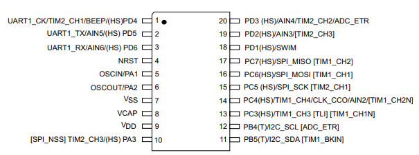

# [STM8S003](https://github.com/SoCXin/STM8S003)
  

#### [Vendor](https://github.com/SoCXin/Vendor)：[ST](https://github.com/SoCXin/ST)
#### [Core](https://github.com/SoCXin/STM8)：[STM8](https://github.com/SoCXin/STM8)
#### [Level](https://github.com/SoCXin/Level)：16MHz 

## [STM8S003描述](https://github.com/SoCXin/STM8S003/wiki) 

[STM8S003](https://github.com/SoCXin/STM8S003)是[STM8S](https://github.com/SoCXin/STM8S)系列中低配置产品,适用于定制各种小型控制设备。

 

* TSSOP20封装

 

* 其他封装规格：QFN20/LQFP32

### [收录资源](https://github.com/SoCXin/STM8S003)

* [文档](docs/)
* [资源](src/)
* [工具](tools/)

#### [外部资源](https://github.com/SoCXin)

* [STM8CubeMX](https://www.st.com/zh/development-tools/stm8cubemx.html)
* [编译器SDCC](https://github.com/SoCXin/sdcc)

### [选型建议](https://github.com/SoCXin)

[STM8S003](https://github.com/SoCXin/STM8S003)是ST单片机中综合成本最低的产品，最常用封装规格TSSOP20，适用于逻辑简单，对IIC/SPI/UART等常规通信接口有需求，但是芯片只有8K flash已经低于市场平均水平。

- 替换产品[N76E003](https://github.com/SoCXin/N76E003) 
- 升级产品[STM8S105](https://github.com/SoCXin/STM8S105) 

###  [SoC芯平台](http://SoC.Xin) 