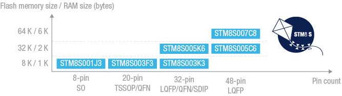

# [STM8S003](https://github.com/sochub/STM8S003)
 

#### [Vendor](https://github.com/sochub/Vendor)：[ST](https://github.com/sochub/ST)
#### [STM8](https://github.com/sochub/STM8)：[STM8](https://github.com/sochub)
#### [Level](https://github.com/sochub/Level)：16MHz 

## [STM8S003描述](https://github.com/sochub/STM8S003/wiki) 

[STM8S003](https://www.st.com/content/st_com/en/products/microcontrollers-microprocessors/stm8-8-bit-mcus/stm8s-series/stm8s-value-line/stm8s003f3.html)是[STM8S](https://github.com/sochub/STM8S)系列中低配置产品,适用于定制各种小型控制设备。

 

### [收录资源](https://github.com/sochub/STM8S003)

* [文档](docs/)
* [资源](src/)

### [关联资源](https://github.com/sochub)

* [SDCC](https://github.com/sochub/sdcc)
* [Platform H02](https://github.com/OS-Q/H02)

### [选型建议](https://github.com/sochub)

- 完美替换[N76E003](https://github.com/sochub/N76E003) 
- 升级方案[STM8S103](https://github.com/sochub/STM8S103) 

##  [SoC资源平台](http://www.qitas.cn)  

